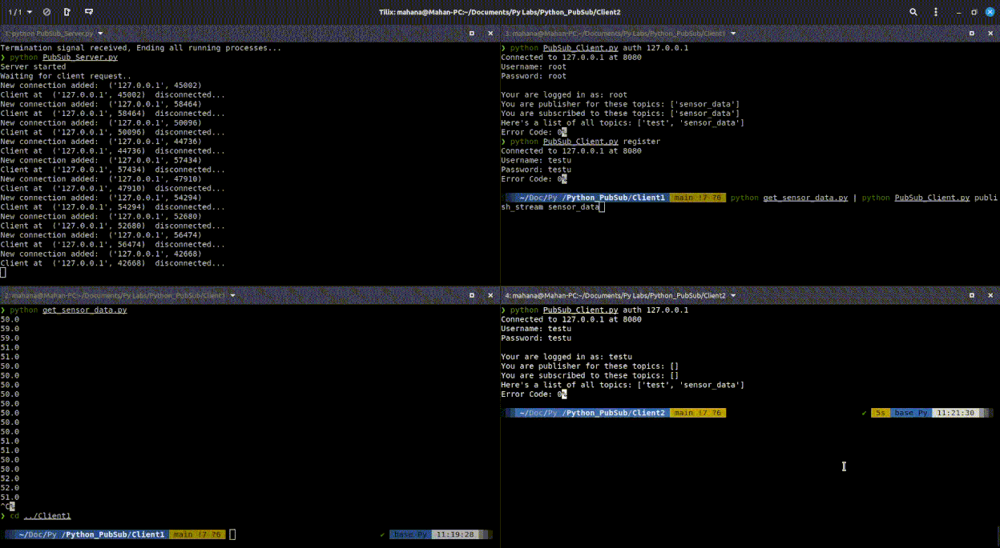

# Simple PubSub Service

This is an implementation of a pub-sub service written from scratch in python with IAM (Identity and Access Management), Multitenancy (using multi-threading), Authentication, and Roles. It supports single message and datastream data transmission.



## Requirements

The modules used in this project are all standard python modules. Networking is implemented using the `socket` module and the data is stored using `JSON` objects.
So there aren't any install requirements.

## Usage

An instance of the server must be running. You can do so by:

```bash
cd Server
python3 PubSub_Server.py
```

Then you can use the service by using the client:

```bash
cd Client
python3 PubSub_Client.py
```

This will print a simple usage guide for the client:
```
You must specify an operation.
Usage: python PubSub_Client.py [OPERATION] [ARGUMENTS]

Operations: auth -> authenticate to a pubsub server
            PubSub_Client.py auth [HOST]

            register -> register a new user (only applicable for root user)
            PubSub_Client.py register

            addrole -> become a publisher or a subscriber to a topic
            PubSub_Client.py addrole [ROLE] [TOPIC]

            publish -> publish a message to a topic that you are a publisher to
            PubSub_Client.py publish [TOPIC] [MESSAGE]

            publish_stream -> publish a stream of data from std_in to a topic that you are a publisher to
            PubSub_Client.py publish_stream [TOPIC]

            syncsub -> get new and unseen data from a topic that you have subscribed
            PubSub_Client.py syncsub [TOPIC]

            info -> get user info
            PubSub_Client.py info         

            syncsub_stream -> get data stream from a topic that you have subscribed
            PubSub_Client.py syncsub_stream [TOPIC]
```

Thus you can authenticate to the server and use the service using the specified operations.